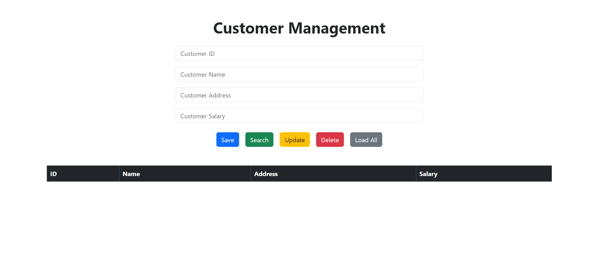

# SpringBoot-MySQL-CRUD Application

## Overview

This project is a basic CRUD (Create, Read, Update, Delete) application built with Spring Boot and MySQL. It provides a
simple customer management system where you can perform CRUD operations on customer data.

## Features

- Create a new customer
- Read customer details
- Update existing customer information
- Delete a customer
- Load all customers

## Technologies Used

- **Spring Boot**: A framework to build stand-alone, production-grade Spring-based applications.
- **MySQL**: A popular relational database management system.
- **Spring Data JPA**: Provides repository support for JPA.
- **Maven**: A build automation tool used for managing project dependencies.
- **Bootstrap**: A framework for building responsive, mobile-first websites.
- **jQuery**: A fast, small, and feature-rich JavaScript library.

## Prerequisites

- **Java**: JDK 8 or later
- **Maven**: 3.x
- **MySQL**: 5.7 or later
- **IDE**: IntelliJ IDEA, Eclipse, or any other Java IDE

⭐️If you hava any bugs or issues ,If you want to explain code please contact me on : 
[kavithmathushal9007@gmail.com](https://www.kavithmathushal9007@gmail.com)  

#### This project is licensed under the [Apache License](LICENSE)

#### © 2024 All Right Reserved, Designed By [Kavithma Thushal](https://github.com/Kavithma-Thushal)

