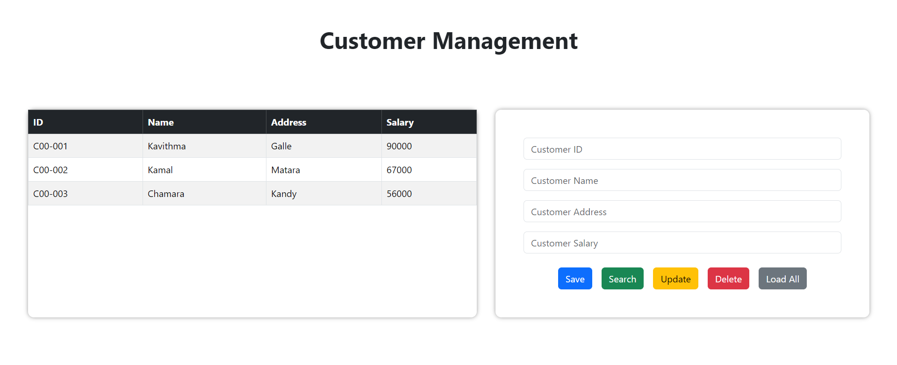
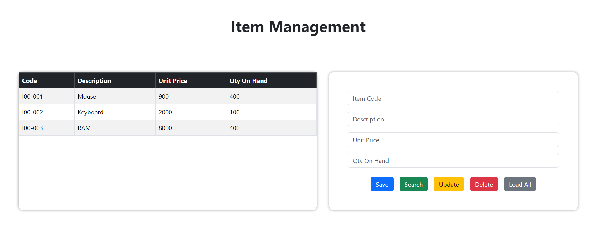

# 🌟 Spring Boot POS Application

The Spring Boot POS Application is a powerful and user-friendly system designed to handle various point-of-sale
functionalities. Built with the Spring Boot framework, this application provides a robust solution for manage Customer
Details, Item Details and Place Orders efficiently.

## 🛠️ Tech Stack

### Frontend

✅ **HTML** 
✅ **CSS** 
✅ **JS** 
✅ **AJAX** 
✅ **JQuery** 
✅ **Bootstrap** 

### Backend

✅ **Spring Boot** 
✅ **Spring Data JPA** 
✅ **Maven** 
✅ **MySQL** 

## 🚀 Features

✅ **Create** Save New Customer. 
✅ **Read** Search Customer. 
✅ **Update** Update Customer Information. 
✅ **Delete** Delete Customer Records. 
✅ **Load All** Display All Customer Records. 

## 📸 Screenshots

### Customer Management

### Item Management

## 📝 Version

**1.0.0**

## 📬 Get in Touch

Got any bugs, issues, or need help understanding the code? Feel free to reach out!

📧 [kavithmathushal9007@gmail.com](mailto:kavithmathushal9007@gmail.com)

#### This project is licensed under the [Apache License](LICENSE)

#### © 2024 All Rights Reserved | Designed by [Kavithma Thushal](https://github.com/Kavithma-Thushal)

