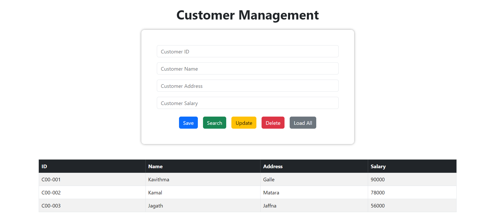

# 🌟 Spring Boot CRUD Application

Welcome to the **Spring Boot CRUD Application**! This project showcases a basic CRUD (Create, Read, Update, Delete)
application developed using Spring Boot and MySQL. It features a simple customer management system, enabling you to
efficiently manage customer data with ease.

## 🛠️ Tech Stack

### Frontend

✅ **HTML** 
✅ **CSS** 
✅ **JS** 
✅ **AJAX** 
✅ **jQuery** 
✅ **Bootstrap** 

### Backend

✅ **Spring Boot** 
✅ **Spring Data JPA** 
✅ **Maven** 
✅ **MySQL** 

## 🚀 Features

✅ **Create** new customer entries. 
✅ **Read** customer details. 
✅ **Update** existing customer information. 
✅ **Delete** customer records. 
✅ **Load** and display all customers. 

## 📸 Screenshots

### Customer Management Interface

## 📝 Version

Current Version : **1.0.0**

## 📬 Get in Touch

Got any bugs, issues, or need help understanding the code? Feel free to reach out!

📧 [kavithmathushal9007@gmail.com](mailto:kavithmathushal9007@gmail.com)

#### This project is licensed under the [Apache License](LICENSE)

#### © 2024 All Rights Reserved | Designed by [Kavithma Thushal](https://github.com/Kavithma-Thushal)

